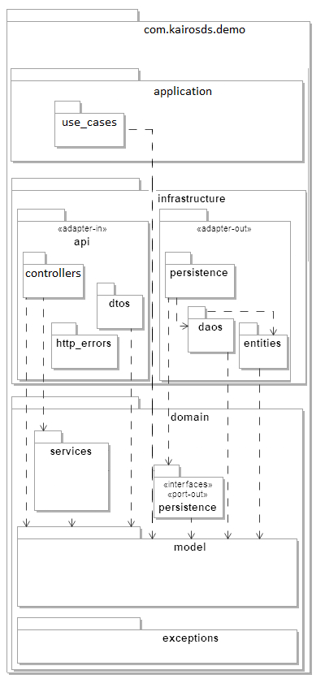

# API REST demo


## Estado del código
[](https://sonarcloud.io/summary/new_code?id=AlbertoNitro_demo)
[](https://sonarcloud.io/summary/new_code?id=AlbertoNitro_demo)


### Tecnologías
`Java` `Maven` `GitHub` `Spring-boot` `Sonarcloud` `JPA` `H2db` `JUnit` `Mockito` `Lombok` `Jacoco`


### :gear: Instalación del proyecto
1. Clonar el repositorio en tu equipo, **mediante consola**:
```sh
> cd <folder path>
> git clone https://github.com/AlbertoNitro/demo.git
```
2. Importar el proyecto mediante **IntelliJ IDEA**
    1. **Import Project**, y seleccionar la carpeta del proyecto.
    2. Marcar **Create Project from external model**, elegir **Maven**.
    3. **Next** … **Finish**.
3. Instalación del proyecto:
```sh
> mvn clean install 
```
4. Ejecución del proyecto:
```sh
> mvn spring-boot:run 
```
5. La API REST queda expuesta en la URL: **http://localhost:8082/api/v0**
6. Para comprobarlo puede realizar una petición HTTP de tipo GET a **http://localhost:8082/api/v0/ping** o 
7. Un ejemplo de busqueda de precio seria: **http://localhost:8082/api/v0/prices/search?brandId=1&productId=35455&applicationDate=2020-11-16T10:50:04.874Z**


### Base de datos
Base de datos relacional en memoria (H2). Se **inicializa una única tabla** con los siguientes datos.
> Table: **prices**

| **brandId** | **startDate**       | **endDate**         | **priceList** | **productId** | **priority** | **priceValue** | **currency** |
|-------------|---------------------|---------------------|---------------|---------------|--------------|----------------|--------------|
| 1           | 2020-06-14-00.00.00 | 2020-12-31-23.59.59 | 1             | 35455         | 0            | 35.50          | EUR          |
| 1           | 2020-06-14-15.00.00 | 2020-06-14-18.30.00 | 2             | 35455         | 1            | 25.45          | EUR          |
| 1           | 2020-06-15-00.00.00 | 2020-06-15-11.00.00 | 3             | 35455         | 1            | 30.50          | EUR          |
| 1           | 2020-06-15-16.00.00 | 2020-12-31-23.59.59 | 4             | 35455         | 1            | 38.95          | EUR          |


### Arquitectura hexagonal (diagrama de paquetes)
)


